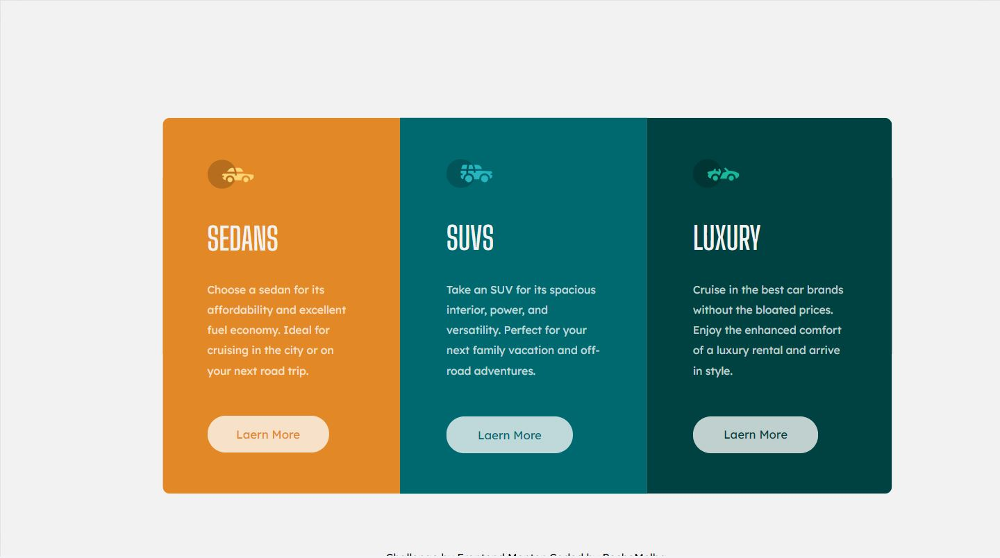

# Frontend Mentor - 3-column preview card component solution

This is a solution to the [3-column preview card component challenge on Frontend Mentor](https://www.frontendmentor.io/challenges/3column-preview-card-component-pH92eAR2-). Frontend Mentor challenges help you improve your coding skills by building realistic projects. 

## Table of contents

- [Overview](#overview)
  - [The challenge](#the-challenge)
  - [Screenshot](#screenshot)
  - [Links](#links)
- [My process](#my-process)
  - [Built with](#built-with)
  - [Notes](#Notes)
- [Author](#author)

## Overview

### The challenge

Users should be able to:

- View the optimal layout depending on their device's screen size
- See hover states for interactive elements

### Screenshot

### Links

- Solution URL: [https://www.frontendmentor.io/solutions/3columnpreviewcardcomponent-fQLBkGmyZ](https://your-solution-url.com)
- Live Site URL: [https://pechemelba.github.io/3_column_preview_card_component/](https://your-live-site-url.com)

## My process

### Built with

- HTML
- CSS
- Flexbox

### Notes

It was my third project as frontend learner. I feel a little more confortable using flexbox. 
I still have some issues to do responsive desing. I would like to improve that skill.

## Author

- Frontend Mentor - [@PecheMelba](https://www.frontendmentor.io/profile/PecheMelba)
